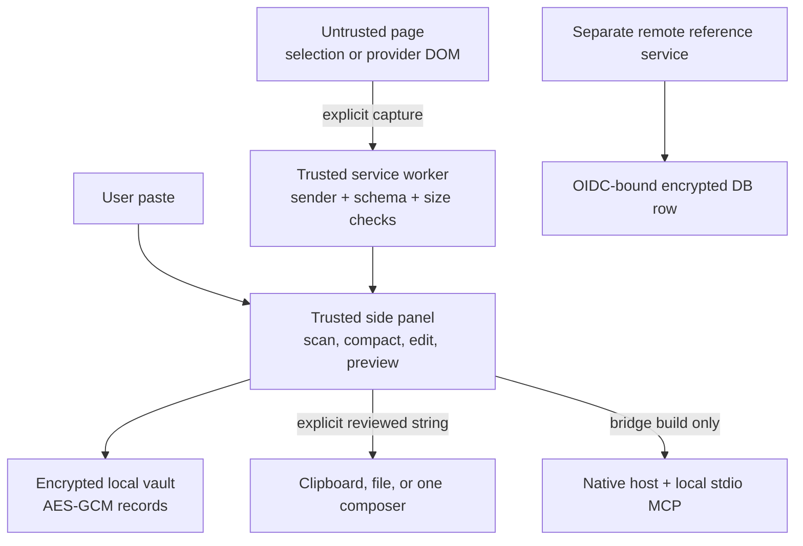

# Architecture

Context Bridge separates page data, trusted extension logic, explicit outbound actions, and optional bridge services. The core extension has no server dependency.

## Components

| Component | Responsibility | Must not do |
| --- | --- | --- |
| Side panel | Onboarding, scan review, deterministic draft, structured editing, revisions, exact outbound preview, settings | Render captured HTML, approve its own warnings, submit provider messages |
| Service worker | Trusted sender validation, inactivity check, active-tab capture, storage/bridge routing, repeat outbound scan and digest | Background browsing, accept page messages, log content |
| Shared context engine | Strict schema, normalization, protected-span extraction, conservative compaction, delta, rendering | Call a model, invent facts, truncate exact artifacts |
| Security scanner | Critical/warning/injection/custom-pattern findings and positional redaction | Claim complete detection |
| Vault | Key lifecycle, authenticated encryption, revisions, destinations, audit, backup, expiry, deletion | Persist passphrase/plaintext or overwrite corrupt ciphertext |
| Provider adapter | Exact-host visible capture and one-composer insertion | Access provider state/cookies, click, retry broadly, press Enter |
| Native host | Length-prefixed activation/revoke/status messages and encrypted per-user active state | Expose a port or print protocol logs to stdout |
| Local MCP server | One read-only `get_active_context` tool over stdio | Activate content, write files, return inactive/expired context |
| Remote service | OIDC/subject authorization, activation API, Streamable HTTP MCP, encrypted TTL store | Start without explicit secure config, trust client subject IDs, log content |

## Trust boundaries

1. Page DOM and imported/pasted conversation text are untrusted data.
2. The extension side panel and worker are trusted code, but all messages still cross a strict schema and trusted-sender check.
3. A reviewed rendered revision becomes outbound-authorized only after final scanning and any warning acknowledgement. Its SHA-256 digest binds insertion/activation to that exact text.
4. The local bridge is a separate OS process and permission. The remote bridge is a separate deployment and identity boundary.

## Core data contract

`shared/context-pack.ts` defines the public schema. Version 1 includes pack/revision IDs, ISO timestamps, structured fields, exact artifacts, evidence, provenance sources with content hashes and trust, sensitivity, optional policy selection, expiry, and parent revision. Unknown fields, dangerous keys, invalid dates/URLs/references, deep objects, and unsupported versions fail closed.

Policies remain in `shared/policies.ts` and are appended only during rendering. Destination revision history, encryption envelopes, audit records, and session key state are internal and absent from public JSON.

## Crypto design

The first vault setup creates a random 128-bit PBKDF2 salt and derives a 256-bit AES-GCM key with PBKDF2-HMAC-SHA-256 at 310,000 iterations. Every envelope uses a fresh random 96-bit IV and authenticates version, record ID, KDF parameters, cipher metadata, creation time, and expiry as AAD. The passphrase is never persisted. Optional browser-session remembering stores only the derived key in `chrome.storage.session`, restricted to trusted extension contexts.

Each encrypted pack record contains the current pack, up to 20 revisions, and opaque user-defined destination markers. Atomic save writes a pending envelope before the final key. Passphrase change prepares a complete re-encryption set and restores the snapshot if persistence fails.

## Build split

- `dist/extension`: permissions `activeTab`, `scripting`, `sidePanel`, `storage`.
- `dist/extension-bridge`: the same code and permissions plus `nativeMessaging`.
- `dist/bridge/local`: native activation host and stdio MCP server.
- `dist/bridge/remote`: disabled-by-default Node service.

The production bundler emits only local scripts, no source maps, and no runtime imports from CDNs. Static audits check permissions, forbidden filenames, remote-code references, dynamic execution, and credential markers.

## Platform references

- [Chrome Side Panel API](https://developer.chrome.com/docs/extensions/reference/api/sidePanel)
- [Chrome activeTab permission](https://developer.chrome.com/docs/extensions/develop/concepts/activeTab)
- [Chrome scripting API](https://developer.chrome.com/docs/extensions/reference/api/scripting)
- [Chrome storage API](https://developer.chrome.com/docs/extensions/reference/api/storage)
- [Chrome extension CSP](https://developer.chrome.com/docs/extensions/reference/manifest/content-security-policy)
- [Official MCP TypeScript SDK](https://github.com/modelcontextprotocol/typescript-sdk)
